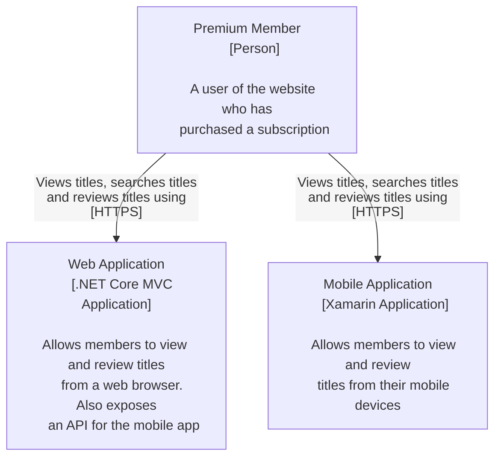

```mermaid
%%{init: {"flowchart": {"htmlLabels": false}} }%%
flowchart TD
    User["Premium Member
    [Person]<br>
    A user of the website who has
    purchased a subscription"]
    WA["Web Application
    [.NET Core MVC Application]
    <br>Allows members to view and review titles
    from a web browser. Also exposes
    an API for the mobile app"]
    MA["Mobile Application
    [Xamarin Application]<br>
    Allows members to view and review
    titles from their mobile devices"]
    User-- "Views titles, searches titles
    and reviews titles using
    [HTTPS]" -->WA
    User-- "Views titles, searches titles
    and reviews titles using
    [HTTPS]" -->MA
```    
